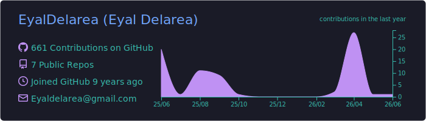
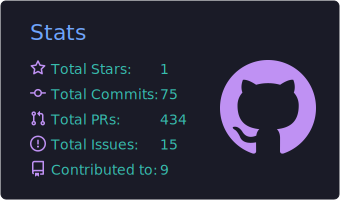
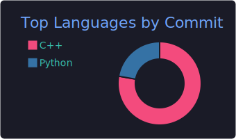
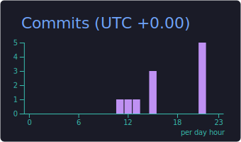
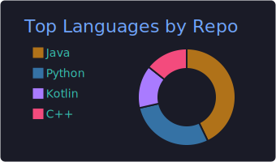

<!-- ════════════════════════════════════════════════════════════════ -->
<!--  Eyal Delarea · GitHub profile README                            -->
<!--  Hero is generated by gen_hero.py → hero-cyber.svg (edit there)  -->
<!-- ════════════════════════════════════════════════════════════════ -->

<div align="center">
  
</div>

<div align="center">
  <a href="https://www.linkedin.com/in/EyalDelarea"></a>
  <a href="mailto:eyaldelarea@gmail.com"></a>
  
</div>

<div align="center">
  
</div>

<br/>

## 👋 About me

<table>
<tr>
<td valign="middle">

```go
package main

type Developer struct {
    Name     string
    Role     string
    Location string
    Stack    []string
    Loves    []string
}

func NewEyal() Developer {
    return Developer{
        Name:     "Eyal Delarea",
        Role:     "Software Developer",
        Location: "Israel 🇮🇱",
        Stack:    []string{"Go", "TypeScript", "Docker"},
        Loves:    []string{"clean code", "good tooling", "synths 🎛️"},
    } // I build because I love it.
}
```

</td>
<td valign="middle" align="center">
  
</td>
</tr>
</table>

<br/>

## 🚀 Featured projects

<!-- ┌─────────────────────────────────────────────────────────────┐ -->
<!-- │ TO ADD A REAL PROJECT: replace a placeholder cell below with │ -->
<!-- │ a repo pin card, e.g.                                        │ -->
<!-- │ <a href="https://github.com/eyaldelarea/REPO">              │ -->
<!-- │    -->
<!-- │ </a>                                                         │ -->
<!-- └─────────────────────────────────────────────────────────────┘ -->

<table align="center">
  <tr>
    <td align="center" width="50%">
      <h3>🚧 Project One</h3>
      <p><i>One line on what it does.</i></p>
      <p><code>Go</code> · <code>Docker</code></p>
      <a href="#">→ repo</a>
    </td>
    <td align="center" width="50%">
      <h3>🚧 Project Two</h3>
      <p><i>One line on what it does.</i></p>
      <p><code>TypeScript</code> · <code>React</code></p>
      <a href="#">→ repo</a>
    </td>
  </tr>
  <tr>
    <td align="center" width="50%">
      <h3>🚧 Project Three</h3>
      <p><i>One line on what it does.</i></p>
      <p><code>Python</code></p>
      <a href="#">→ repo</a>
    </td>
    <td align="center" width="50%">
      <h3>🚧 Project Four</h3>
      <p><i>One line on what it does.</i></p>
      <p><code>Java</code></p>
      <a href="#">→ repo</a>
    </td>
  </tr>
</table>

<br/>

## 🛠️ Tech stack

<div align="center">
  
</div>

<br/>

## 🐍 Contribution snake

<!-- Auto-generated daily by the profile-graphics workflow (Platane/snk), themed neon. -->
<div align="center">
  
</div>

<br/>

## 📊 Stats

<!-- Generated as committed SVGs by the profile-graphics workflow (always render, no flaky service). -->
<div align="center">
  
</div>

<div align="center">
  
  
</div>

<div align="center">
  
  
</div>

<br/>

## 🔗 Connect

<div align="center">
  <a href="https://www.linkedin.com/in/EyalDelarea"></a>
  <a href="mailto:eyaldelarea@gmail.com"></a>
  <a href="https://github.com/EyalDelarea"></a>
</div>

<div align="center"><sub>🎛️ Hero synth hand-built in SVG · snake & stats auto-update daily</sub></div>
