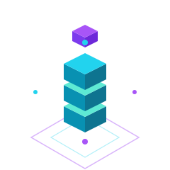

<!-- ════════════════════════════════════════════════════════════════ -->
<!--  Eyal Delarea · GitHub profile README                            -->
<!--  Hero is generated by gen_hero.py → hero-cyber.svg (edit there)  -->
<!-- ════════════════════════════════════════════════════════════════ -->

<div align="center">
  
</div>

<div align="center">
  <a href="https://www.linkedin.com/in/EyalDelarea"></a>
  <a href="mailto:eyaldelarea@gmail.com"></a>
  
</div>

<div align="center">
  
</div>

<br/>

## 👋 About me

<table>
<tr>
<td valign="middle">

```go
package main

type Developer struct {
    Name     string
    Role     string
    Location string
    Stack    []string
    Loves    []string
}

func NewEyal() Developer {
    return Developer{
        Name:     "Eyal Delarea",
        Role:     "Software Developer",
        Location: "Israel 🇮🇱",
        Stack:    []string{"Go", "TypeScript", "Docker"},
        Loves:    []string{"clean code", "good tooling", "synths 🎛️"},
    } // I build because I love it.
}
```

</td>
<td valign="middle" align="center">
  
</td>
</tr>
</table>

<br/>

## 🛠️ Tech stack

<div align="center">
  
</div>

<br/>

## 🐍 Contribution snake

<!-- Auto-generated daily by the profile-graphics workflow (Platane/snk), themed neon. -->
<div align="center">
  
</div>

<br/>

## 🔗 Connect

<div align="center">
  <a href="https://www.linkedin.com/in/EyalDelarea"></a>
  <a href="mailto:eyaldelarea@gmail.com"></a>
  <a href="https://github.com/EyalDelarea"></a>
</div>

<div align="center"><sub>🎛️ Hero synth hand-built in SVG · snake auto-updates daily</sub></div>
